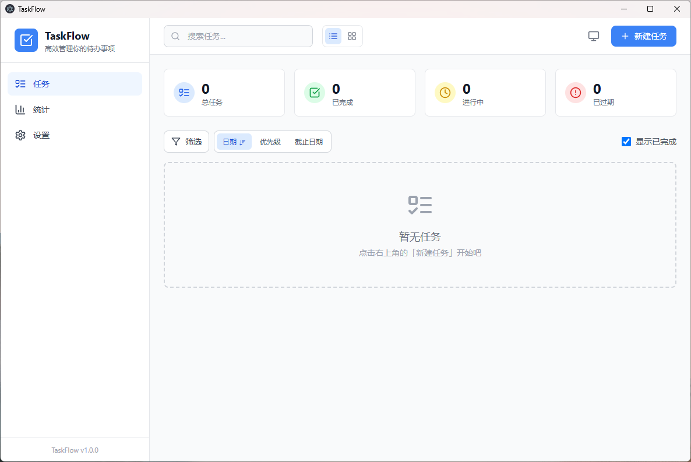
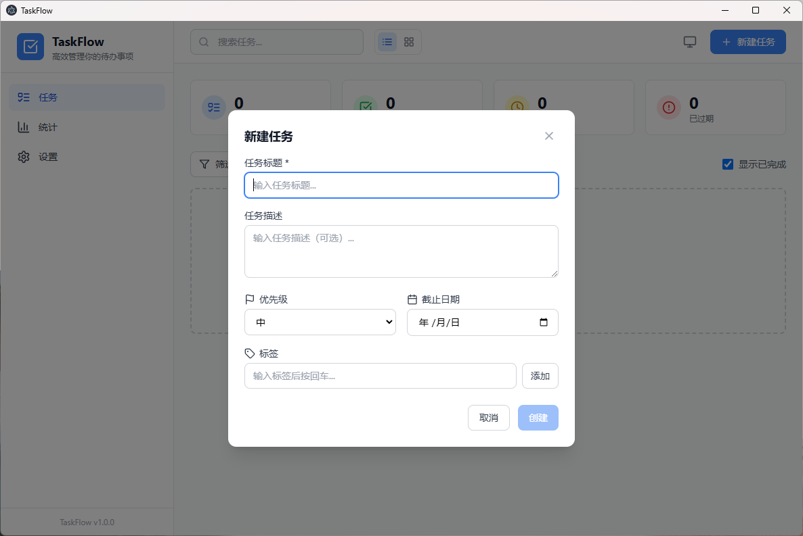
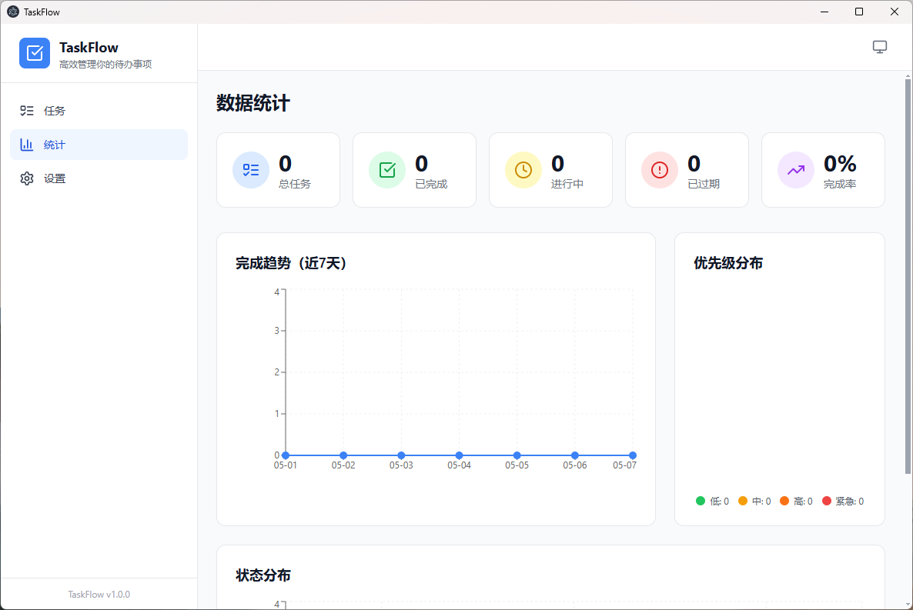
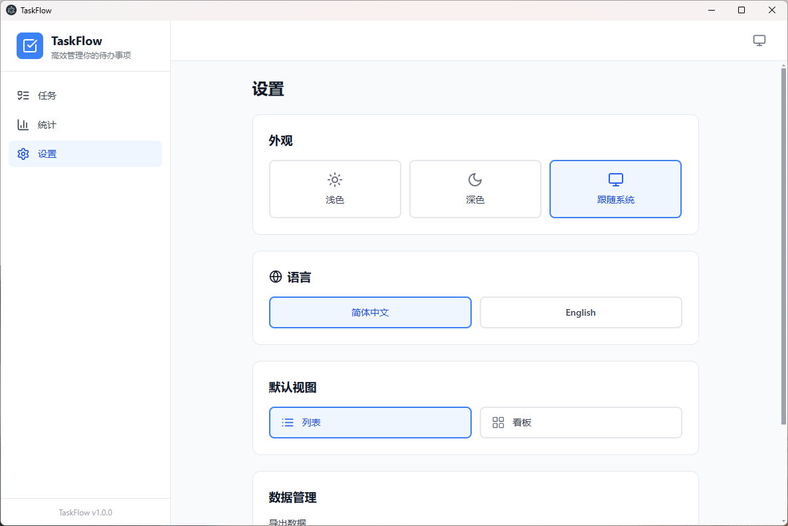

# TaskFlow / 任务流

A powerful, beautiful task management desktop app with AI-powered task generation. / 一款强大优雅的桌面任务管理应用，支持 AI 智能生成任务。

[English](#english) | [中文](#中文)

---

## English

### Features

- **Task Management**: Create, edit, delete, and organize your tasks
- **AI Task Generation**: Paste unstructured text (notifications, chat records, meeting notes) and AI automatically extracts tasks — supports DeepSeek, ChatGPT, and any OpenAI-compatible API
- **Multiple Views**: Switch between list view and kanban board view with drag-and-drop
- **Priority Levels**: Set priority (Low, Medium, High, Urgent) with color coding
- **Tags & Subtasks**: Organize with custom tags and break down tasks into subtasks
- **Due Dates**: Set deadlines with time picker and get visual overdue indicators
- **Search & Filter**: Quickly find tasks with powerful search and filtering
- **Dark Mode**: Light, dark, and system-follow themes
- **Statistics**: Visualize productivity with charts and analytics
- **Data Import/Export**: Export as JSON/CSV and import with deduplication
- **i18n**: Chinese and English support
- **Keyboard Shortcuts**: Boost productivity with keyboard shortcuts
- **Local Storage**: All data stored locally — full privacy

### AI Task Generation

TaskFlow integrates AI to turn unstructured text into structured tasks.

**Supported Providers:**

| Provider | Default Model | API URL |
|---|---|---|
| DeepSeek | `deepseek-v4-flash` | `https://api.deepseek.com` |
| ChatGPT | `gpt-4o-mini` | `https://api.openai.com` |
| Custom | (user-defined) | any OpenAI-compatible endpoint |

**How to Use:**
1. Go to **Settings → AI Configuration** and configure your API model, URL, and key
2. Click the **AI Generate** button (Sparkles icon) in the header
3. Paste your text (notifications, chat records, meeting notes, Excel exports, etc.)
4. Click **Generate Tasks** — AI will analyze and extract tasks
5. **Review** the suggested tasks (edit titles, priorities, tags, dates; remove unwanted ones)
6. Click **Create N Tasks** to add them to your task list

Your API key is stored locally and never sent anywhere except your configured AI provider.

### Screenshots

#### Main Page



#### New Task



#### Statistics



#### Settings



### Installation (Windows)

Download the latest installer from [Releases](https://github.com/RedTemperature/taskflow/releases):

- **`taskflow-x.x.x-setup.exe`** — Installer with desktop shortcut and custom install path
- **`TaskFlow x.x.x.exe`** — Portable, no installation required

### Tech Stack

| Layer | Technology |
|---|---|
| Desktop Framework | Electron |
| Frontend | React 19 + TypeScript |
| Build Tool | Vite |
| State Management | Zustand |
| UI | Tailwind CSS + Radix UI |
| Drag & Drop | @dnd-kit |
| Charts | Recharts |
| AI SDK | OpenAI |
| i18n | i18next |
| Icons | Lucide React |

### Keyboard Shortcuts

| Shortcut | Action |
|---|---|
| `Space` | Toggle task status (when selected) |
| `Ctrl/Cmd + Delete` | Delete task (when selected) |
| `Escape` | Deselect task |
| `Ctrl/Cmd + 1` | Go to Tasks |
| `Ctrl/Cmd + 2` | Go to Statistics |
| `Ctrl/Cmd + 3` | Go to Settings |

### Development

**Prerequisites**: Node.js 18+

```bash
git clone https://github.com/RedTemperature/taskflow.git
cd taskflow
npm install
npm run dev          # Start dev server
npm run build        # Production build
npm run package:win  # Package for Windows
```

### Project Structure

```
TaskFlow/
├── electron/          # Electron main process
│   ├── main.ts        # Main process entry
│   ├── preload.ts     # Preload script (secure bridge)
│   ├── store.ts       # Data persistence (electron-store)
│   └── ipc.ts         # IPC handlers (including AI)
├── src/               # React renderer process
│   ├── components/
│   │   ├── ai/        # AI task generator
│   │   ├── layout/    # Layout, Sidebar, Header
│   │   ├── tasks/     # Task management
│   │   ├── board/     # Kanban board
│   │   ├── stats/     # Statistics & charts
│   │   └── settings/  # Settings (including AI config)
│   ├── hooks/         # useTheme, useShortcuts
│   ├── stores/        # Zustand stores
│   ├── utils/         # Export, import, date utilities
│   └── i18n/          # zh-CN, en-US
├── shared/            # Shared TypeScript types
└── .github/           # Issue templates & workflows
```

---

## 中文

### 功能特性

- **任务管理**：创建、编辑、删除、组织任务
- **AI 任务生成**：粘贴非结构化文本（通知、聊天记录、会议纪要），AI 自动提取任务 — 支持 DeepSeek、ChatGPT 及任意 OpenAI 兼容 API
- **多视图**：列表视图与看板视图，支持拖拽排序
- **优先级**：四级优先级（低/中/高/紧急），颜色区分
- **标签与子任务**：自定义标签分类，拆解复杂任务
- **截止日期**：支持日期+时间选择，逾期可视化提醒
- **搜索筛选**：按状态、优先级、标签、日期范围筛选
- **暗色模式**：浅色 / 深色 / 跟随系统
- **数据统计**：图表展示完成趋势、优先级分布
- **数据导入导出**：JSON/CSV 格式，导入自动去重
- **国际化**：中文 / English 切换
- **快捷键**：提升操作效率
- **本地存储**：数据完全本地化，保护隐私

### AI 任务生成

TaskFlow 集成 AI，将非结构化文本转化为结构化任务。

**支持的服务商：**

| 服务商 | 默认模型 | API 地址 |
|---|---|---|
| DeepSeek | `deepseek-v4-flash` | `https://api.deepseek.com` |
| ChatGPT | `gpt-4o-mini` | `https://api.openai.com` |
| 自定义 | 用户自定 | 任意 OpenAI 兼容端点 |

**使用方法：**
1. 进入 **设置 → AI 配置**，填写模型名称、API 地址和密钥
2. 点击顶栏的 **AI 生成** 按钮（Sparkles 图标）
3. 粘贴文本（通知、聊天记录、会议纪要、Excel 导出等）
4. 点击 **生成任务** — AI 将自动分析并提取任务
5. **预览检查**建议的任务（可修改标题、优先级、标签、日期，或删除）
6. 点击 **创建 N 个任务** 确认添加

API 密钥仅本地存储，只发送到你配置的 AI 服务商。

### 截图

#### 主页面


#### 新建任务


#### 统计页面


#### 设置页面


### 安装 (Windows)

从 [Releases](https://github.com/RedTemperature/taskflow/releases) 下载最新版本：

- **`taskflow-x.x.x-setup.exe`** — 安装包，自动创建桌面快捷方式，支持自定义安装路径
- **`TaskFlow x.x.x.exe`** — 便携版，无需安装，双击即用

### 技术栈

| 层级 | 技术 |
|---|---|
| 桌面框架 | Electron |
| 前端 | React 19 + TypeScript |
| 构建工具 | Vite |
| 状态管理 | Zustand |
| UI | Tailwind CSS + Radix UI |
| 拖拽 | @dnd-kit |
| 图表 | Recharts |
| AI SDK | OpenAI |
| 国际化 | i18next |
| 图标 | Lucide React |

### 快捷键

| 快捷键 | 操作 |
|---|---|
| `空格` | 切换任务完成状态（需选中任务） |
| `Ctrl + Delete` | 删除任务（需选中任务） |
| `Escape` | 取消选中 |
| `Ctrl + 1` | 前往任务页 |
| `Ctrl + 2` | 前往统计页 |
| `Ctrl + 3` | 前往设置页 |

### 开发指南

**环境要求**：Node.js 18+

```bash
git clone https://github.com/RedTemperature/taskflow.git
cd taskflow
npm install
npm run dev          # 启动开发服务器
npm run build        # 生产构建
npm run package:win  # 打包 Windows 安装包
```

### 项目结构

```
TaskFlow/
├── electron/          # Electron 主进程
│   ├── main.ts        # 主进程入口
│   ├── preload.ts     # 预加载脚本（安全桥接）
│   ├── store.ts       # 数据持久化（electron-store）
│   └── ipc.ts         # IPC 处理器（含 AI 调用）
├── src/               # React 渲染进程
│   ├── components/
│   │   ├── ai/        # AI 任务生成器
│   │   ├── layout/    # 布局组件
│   │   ├── tasks/     # 任务管理
│   │   ├── board/     # 看板
│   │   ├── stats/     # 统计图表
│   │   └── settings/  # 设置（含 AI 配置）
│   ├── hooks/         # useTheme, useShortcuts
│   ├── stores/        # Zustand 状态
│   ├── utils/         # 导入导出、日期工具
│   └── i18n/          # 中英文翻译
├── shared/            # 共享类型定义
└── .github/           # Issue 模板与工作流
```

---

## License / 许可证

MIT License — see [LICENSE](LICENSE)

---

Made with ❤️ by TaskFlow Contributors
